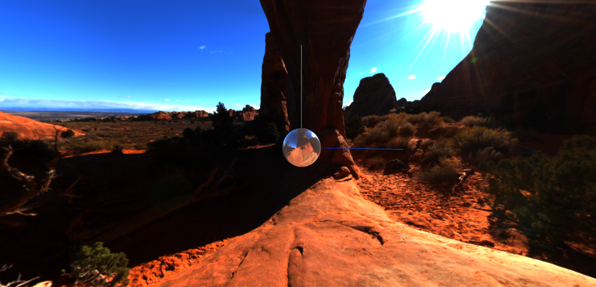
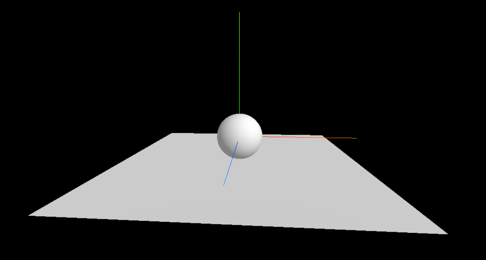
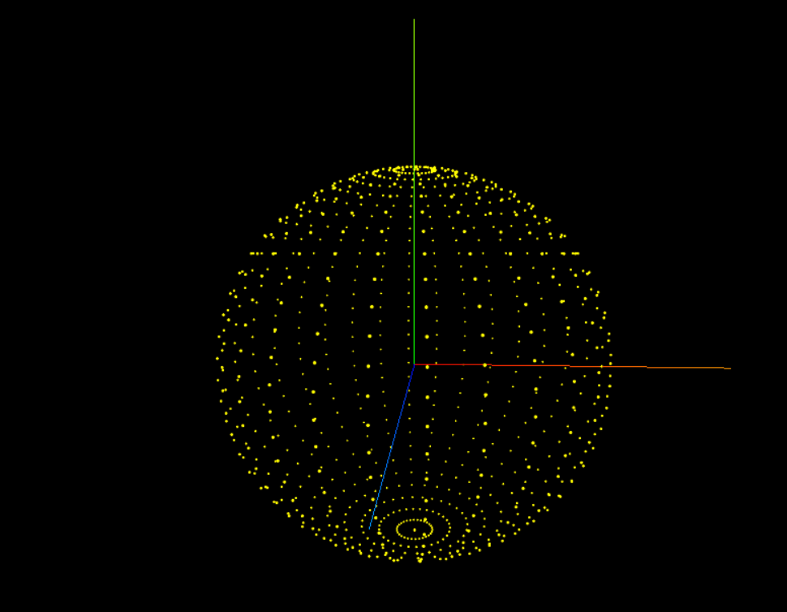
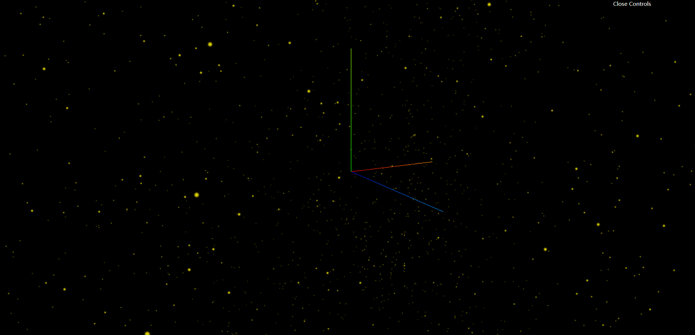
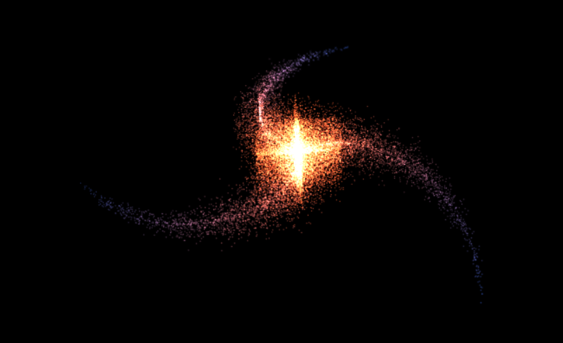

## README











### 项目搭建

```shell
npm init -y
npm install --save-dev parcel
npm install three --save
npm install gsap
npm install --save dat.gui
npm install --save cannon-es
```

运行

```shell
npm run dev
```

### 文档

官网

https://threejs.org

打包工具

[parcel](https://v2.parceljs.cn/)

GSAP动画库

[GSAP](https://greensock.com/)

The Book of Shaders

https://thebookofshaders.com/

SpriteJS

http://spritejs.com

### 版本

node v18.16.0
npm 9.5.1
